<p align="center">
  
  
  
  
  
</p>

# claude-token-statusbar

A reactive token & cost status line for the **Claude Code** TUI. Live token counts,
cumulative session spend, and cache usage — right in the terminal, updated on every
message.



```
[Sonnet 5]  in 19.9k  out 16.0k  cache 25.3k/2.9k  $0.10
```

## Why?

Claude Code shows token usage only in the full screen `/status` view — which means
most people find out how much a session cost **after** the damage is done. With
`claude-token-statusbar` you always know, at a glance:

- **How many tokens** you've sent in and gotten back this session (cumulative)
- **What it cost** so far — in real time, so you can run `/compact` before it balloons
- **How much cache** you're writing vs. reading (the lever that drives cost down)
- Which **model** you're talking to

> 💡 Enterprise budgets (Anthropic, OpenAI, etc.) get exhausted fast when usage is
> invisible. Seeing the per-session cost climbing is the nudge most people need to
> `/compact` more often and keep long-running sessions lean.

## Features

- **Cumulative session totals** — parses the session transcript, so totals include
  every message (not just the current context window)
- **Cost tracking** — uses the client-estimated cost from Claude Code, with a
  transcript fallback so you see spend even in older sessions
- **Cache read/write breakdown** — know exactly how much prompt caching is doing
- **Dependency-free** — pure Node, no npm runtime deps, never crashes the TUI
- **One-command install / uninstall** — writes the `statusLine` into your
  `~/.claude/settings.json` (with a `.bak` backup), or per-project
- **Fast** — transcript results are cached by `session_id` + file mtime/size

## Install

```bash
# install the CLI (anywhere)
npm install -g claude-token-statusbar

# configure the status line for the current user
claude-token-statusbar install
```

Restart `claude` (or start a new session) and the status line appears at the bottom.

> **Already have a `statusLine` set?** The installer detects it and refuses to
> overwrite — read the backup file or your existing config before changing.

## Usage

```bash
claude-token-statusbar install [--scope user|project]   # default: user (~/.claude)
claude-token-statusbar uninstall [--scope user|project]
claude-token-statusbar test                              # print a sample line
```

- `--scope user` writes to `~/.claude/settings.json` (recommended).
- `--scope project` writes to `<cwd>/.claude/settings.json`.
- No npx needed — `claude-token-statusbar` is a real binary after install.

### Manual setup (no installer)

Add to your `~/.claude/settings.json`:

```json
{
  "statusLine": {
    "type": "command",
    "command": "node ~/.claude/statusline.mjs",
    "refreshInterval": 1
  }
}
```

The script lives at `~/.claude/statusline.mjs` after `install`.

## What you're looking at

The status line shows, left to right:

| Segment | Meaning |
| --- | --- |
| `[Model]` | `model.display_name` from the current payload |
| `in` | Cumulative input tokens this session |
| `out` | Cumulative output tokens this session |
| `cache` | Cumulative cache reads / cache writes |
| `$` | Cumulative session cost (client estimate) |

All token counts are **cumulative for the session** — summed from the session
transcript — rather than the current context window. Cost comes from
`cost.total_cost_usd` when present, falling back to summed `costUSD` from the
transcript.

## How it works

Claude Code's `statusLine` runs a command with a JSON payload on stdin, and
re-runs it whenever your context changes. This package renders one line from that
payload and sums the session transcript (`transcript_path`, a JSONL file) for true
cumulative totals. Results are cached per session and invalidated on file change,
so the status line stays instant.

## Compatibility

- Requires Node.js **20+**
- Tested with Claude Code **2.1.x** (statusline feature)
- Works with any model/plan Claude Code reports usage for

## Spread the word

Liked it? Star the repo, share it, or add the badge to your own README:

```markdown
[](https://github.com/hesreallyhim/awesome-claude-code)
```

## Development

```bash
npm ci
npm run typecheck   # tsc --noEmit (strict, checkJs)
npm test            # node --test
```

## Contributing

Issues and PRs welcome — see [CONTRIBUTING](./CONTRIBUTING.md).

## License

MIT — see [LICENSE](./LICENSE).
